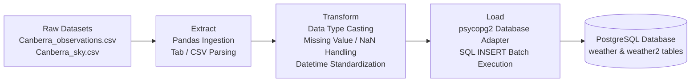

# Canberra Weather Data ETL Pipeline

An end-to-end Python ETL (Extract, Transform, Load) pipeline for extracting, cleaning, transforming, and loading Canberra meteorological and sky observation datasets into a PostgreSQL relational database.

---

## 📌 Project Overview

This project processes historical weather data for Canberra, Australia, consisting of meteorological observations and sky/visibility reports. The pipeline ingests raw tab-separated and delimited CSV data, performs comprehensive data cleaning and type transformations, and loads the structured data into PostgreSQL for analytics and query workloads.

### Key Highlights
- **Extract**: Ingestion of raw weather observations and sky condition records.
- **Transform**: 
  - Standardized datetime parsing and date/time separation.
  - Handled missing/NaN values and placeholder symbols (e.g., `-` indicators in fire danger indices).
  - Data type casting to native Python/Pandas types (`datetime64`, `float64`, `str`, nullable `None` objects).
- **Load**: Relational schema modeling and batch/row insertion into PostgreSQL via `psycopg2`.

---

## 🗂 Repository Structure

```text
python_etl_pipeline/
├── datasets/
│   ├── Canberra_observations.csv   # Raw weather observation records (tab-separated)
│   └── Canberra_sky.csv            # Raw sky condition and visibility records
├── src/
│   └── etl/
│       └── __init__.py             # ETL package initialization
├── canberra_observations.ipynb     # Interactive ETL workflow for weather observations
├── canberra_sky.ipynb              # Interactive ETL workflow for sky & visibility data
├── pyproject.toml                  # Project metadata and UV package configuration
├── requirements.txt                # Python package dependencies
├── uv.lock                         # Pinned dependency lockfile
└── README.md                       # Project documentation
```

---

## 🔄 ETL Pipeline Architecture



### 1. Extract
- Ingests `Canberra_observations.csv` (tab-delimited observation records containing temperature, humidity, wind, rainfall, pressure, and fire danger indices).
- Ingests `Canberra_sky.csv` (records of sky coverage and visibility).

### 2. Transform
- **Data Validation & Profiling**: Summary statistics, column distributions, and null rate inspections.
- **Missing Value Handling**: Replaces `NaN` values and string placeholders with SQL-compatible `None` / `NULL`.
- **Data Casting**: Formats dates into `YYYY-MM-DD`, times into `HH:MM`, and numerical measurements into respective `float64` / `INTEGER` precision.

### 3. Load
Target database tables created and populated in PostgreSQL:

#### `weather` Table (Sky Conditions)
| Column Name | Type | Description |
| :--- | :--- | :--- |
| `date` | `DATE` | Observation date |
| `time` | `TIME` | Observation time |
| `visibility` | `NUMERIC / FLOAT` | Visibility distance measurement |
| `cloud` | `VARCHAR(50)` | Sky and cloud coverage category |

#### `weather2` Table (Detailed Meteorological Observations)
| Column Name | Type | Description |
| :--- | :--- | :--- |
| `observation_date` | `DATE` | Date of observation |
| `observation_time` | `TIME` | Time of observation |
| `wind_direction` | `VARCHAR(10)` | Wind compass direction |
| `wind_speed_kmh` | `NUMERIC` | Wind speed in km/h |
| `wind_gust_speed_kmh` | `NUMERIC` | Peak wind gust speed in km/h |
| `temperature_c` | `NUMERIC` | Ambient temperature in °C |
| `dew_point_c` | `NUMERIC` | Dew point temperature in °C |
| `feels_like_temperature_c`| `NUMERIC` | Apparent ("feels like") temperature in °C |
| `relative_humidity_percent`| `NUMERIC` | Relative humidity percentage |
| `fire_index` | `VARCHAR(20)` | Fire danger rating index |
| `rainfall_mm` | `NUMERIC` | Cumulative rainfall in mm |
| `rainfall_10min_mm` | `NUMERIC` | 10-minute rainfall interval in mm |
| `air_pressure_hpa` | `NUMERIC` | Atmospheric pressure in hPa |

---

## ⚙️ Prerequisites & Tech Stack

- **Python**: `>= 3.13`
- **Package / Environment Manager**: [uv](https://github.com/astral-sh/uv) or `pip`
- **Database**: PostgreSQL
- **Key Libraries**:
  - `pandas`
  - `numpy`
  - `psycopg2-binary`
  - `ipykernel`

---

## 🚀 Getting Started

### 1. Clone the Repository
```bash
git clone https://github.com/sreeshanthkprakash-stack/python_etl_pipeline.git
cd python_etl_pipeline
```

### 2. Set Up Virtual Environment

#### Using `uv` (Recommended)
```bash
uv venv
# On Windows:
.venv\Scripts\activate
# On macOS/Linux:
source .venv/bin/activate

uv sync
```

#### Using `pip`
```bash
python -m venv .venv
# On Windows:
.venv\Scripts\activate
# On macOS/Linux:
source .venv/bin/activate

pip install -r requirements.txt
```

---

## 🗄️ Database Setup

Ensure PostgreSQL is running locally, then create the necessary target database and tables:

```sql
-- Connect to PostgreSQL and create database
CREATE DATABASE weather;

-- Create Sky Conditions table
\c weather;

CREATE TABLE IF NOT EXISTS weather (
    date DATE,
    time TIME,
    visibility NUMERIC,
    cloud VARCHAR(50)
);

-- Create Detailed Observations table
CREATE TABLE IF NOT EXISTS weather2 (
    observation_date DATE,
    observation_time TIME,
    wind_direction VARCHAR(10),
    wind_speed_kmh NUMERIC,
    wind_gust_speed_kmh NUMERIC,
    temperature_c NUMERIC,
    dew_point_c NUMERIC,
    feels_like_temperature_c NUMERIC,
    relative_humidity_percent NUMERIC,
    fire_index VARCHAR(20),
    rainfall_mm NUMERIC,
    rainfall_10min_mm NUMERIC,
    air_pressure_hpa NUMERIC
);
```

> **Note**: Update the PostgreSQL credentials (host, port, database, user, password) inside the notebooks to match your local PostgreSQL configuration.

---

## 📈 Running the Pipeline

You can execute the ETL steps interactively using Jupyter Notebooks:

1. Launch Jupyter Notebook / JupyterLab:
   ```bash
   jupyter notebook
   ```
2. Run [`canberra_observations.ipynb`](file:///c:/Users/SREESHANTH_K/Desktop/etl/canberra_observations.ipynb) to process and load detailed meteorological observations.
3. Run [`canberra_sky.ipynb`](file:///c:/Users/SREESHANTH_K/Desktop/etl/canberra_sky.ipynb) to process and load sky and visibility metrics.

---

## 📜 License

This project is open-source and available under the [MIT License](LICENSE).
